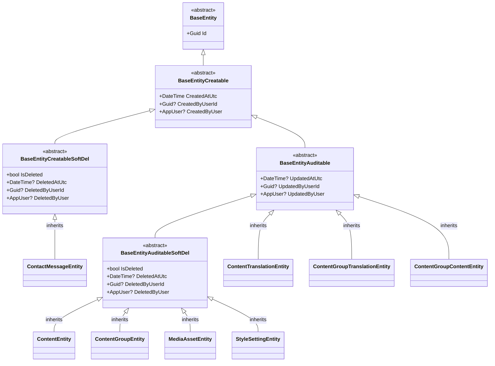

# Entity Inheritance Hierarchy

This document visualizes the inheritance hierarchy of base and concrete domain entities in `Aldaman.Persistence.Entities`.

## Overview Diagram



---

## Detailed Tree View

```text
BaseEntity (Id)
└── BaseEntityCreatable (CreatedAtUtc, CreatedByUserId, CreatedByUser)
    │
    ├── BaseEntityCreatableSoftDel (IsDeleted, DeletedAtUtc, DeletedByUserId, DeletedByUser)
    │   └── ContactMessageEntity
    │
    └── BaseEntityAuditable (UpdatedAtUtc, UpdatedByUserId, UpdatedByUser)
        │
        ├── ContentTranslationEntity
        ├── ContentGroupTranslationEntity
        ├── ContentGroupContentEntity
        │
        └── BaseEntityAuditableSoftDel (IsDeleted, DeletedAtUtc, DeletedByUserId, DeletedByUser)
            ├── ContentEntity
            ├── ContentGroupEntity
            ├── MediaAssetEntity
            └── StyleSettingEntity
```

---

## Entity Classification Summary

| Base Class | Properties Added | Concrete Entities |
|---|---|---|
| `BaseEntity` | `Id` | *(None directly)* |
| `BaseEntityCreatable` | `CreatedAtUtc`, `CreatedByUserId`, `CreatedByUser` | *(None directly)* |
| `BaseEntityCreatableSoftDel` | `IsDeleted`, `DeletedAtUtc`, `DeletedByUserId`, `DeletedByUser` | `ContactMessageEntity` |
| `BaseEntityAuditable` | `UpdatedAtUtc`, `UpdatedByUserId`, `UpdatedByUser` | `ContentTranslationEntity`, `ContentGroupTranslationEntity`, `ContentGroupContentEntity` |
| `BaseEntityAuditableSoftDel` | `IsDeleted`, `DeletedAtUtc`, `DeletedByUserId`, `DeletedByUser` | `ContentEntity`, `ContentGroupEntity`, `MediaAssetEntity`, `StyleSettingEntity` |

> [!NOTE]
> `AppUser` and `AppRole` are ASP.NET Core Identity entities inheriting from `IdentityUser<Guid>` and `IdentityRole<Guid>` respectively.
